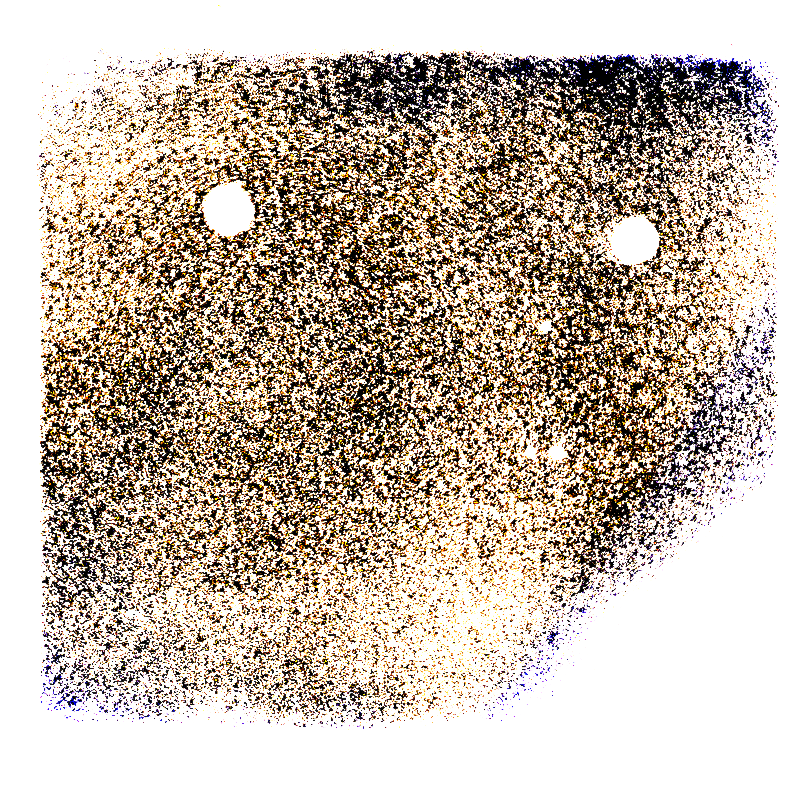

---
title:Corps
---

**Spectateur-corps**. A priori, n’a rien à dire. Sauf quand il se déplace. Quand il déplace son corps hors de ses lieux de vie habituels. Spectateur, ça commence par les pieds.

 
 
 ***