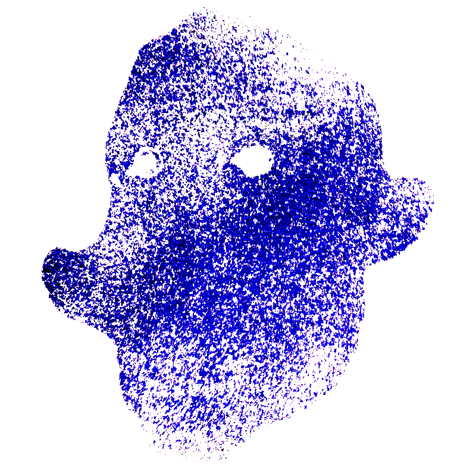

**Spectateur-Hongrois**. Applaudit comme tout à chacun mais en accélérant puis en ralentissant le rythme pour un nouveau crescendo. Ces applaudissements cadencés - "ritmikus taps" - sont là une énigme à la mesure de la langue hongroise.

***
[bibliothèque](http://dicospec.g-u-i.net/about)